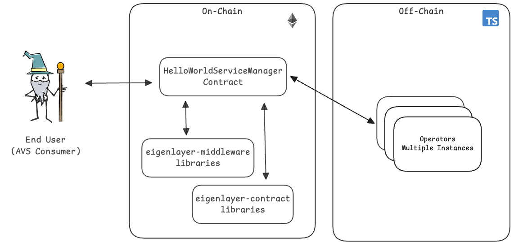

# Hello World AVS

Welcome to the Hello World AVS. This project shows you the simplest functionality you can expect from an AVS. It will give you a concrete understanding of the basic components. For new users, please find [this video walkthrough](https://drive.google.com/file/d/1P6uA6kYWCbpeorTjADuoTlQ-q8uqwPZf/view?usp=sharing) of the hello world AVS repository.

## Architecture



### AVS User Flow

1) AVS consumer requests a "Hello World" message to be generated and signed.
2) HelloWorld contract receives the request and emits a NewTaskCreated event for the request.
3) All Operators who are registered to the AVS and has staked, delegated assets takes this request. Operator generates the requested message, hashes it, and signs the hash with their private key.
4) Each Operator submits their signed hash back to the HelloWorld AVS contract.
5) If the Operator is registered to the AVS and has the minimum needed stake, the submission is accepted.

That's it. This simple flow highlights some of the core mechanics of how AVSs work.

### Slashing

> [!WARNING]
> This example does not use the new operator-sets workflow. Please refer to [ELIP-002](https://github.com/eigenfoundation/ELIPs/blob/main/ELIPs/ELIP-002.md) for more details.
> For an example of the new workflow, check out the Incredible Squaring examples ([Go version here](https://github.com/Layr-Labs/incredible-squaring-avs), [Rust version here](https://github.com/Layr-Labs/incredible-squaring-avs-rs)).

The example includes a simple slashing condition: "a task MUST be responded by enough operators before N blocks have passed since the task creation". You can modify the `OPERATOR_RESPONSE_PERCENTAGE` value in the `.env` file to adjust the chance of an operator responding to a task.
In case this condition isn't satisfied by some operator, anyone can permissionlessly slash them via calling `HelloWorldServiceManager.slashOperator`.

For the [Rust example](#quick-start-rust), we have a `challenger` that listens for new tasks and checks whether the operators have responded. If not, `challenger` is authorized to slash the operator.

## Local Devnet Deployment

The following instructions explain how to manually deploy the AVS from scratch including EigenLayer and AVS specific contracts using Foundry (forge) to a local anvil chain, and start Typescript Operator application and tasks.

## Development Environment

This section describes the tooling required for local development.

### Non-Nix Environment

Install dependencies:

- [Node](https://nodejs.org/en/download/)
- [Typescript](https://www.typescriptlang.org/download)
- [ts-node](https://www.npmjs.com/package/ts-node)
- [tcs](https://www.npmjs.com/package/tcs#installation)
- [npm](https://docs.npmjs.com/downloading-and-installing-node-js-and-npm)
- [Foundry](https://getfoundry.sh/)
- [ethers](https://www.npmjs.com/package/ethers)

### Nix Environment 

On [Nix](https://nixos.org/) platforms, if you already have the proper Nix configuration, you can build the project's artifacts inside a `nix develop` shell

``` sh
nix develop
```

Otherwise, please refer to [installed and configured](./docs/nix-setup-guide.md) section.

## Quick start (TypeScript)

### Start Anvil Chain

In terminal window #1, execute the following commands:

```sh

# Install npm packages
npm install

# Start local anvil chain
npm run start:anvil
```

### Deploy Contracts and Start Operator

Open a separate terminal window #2, execute the following commands

```sh
# Setup .env file
cp .env.example .env
cp contracts/.env.example contracts/.env

# Updates dependencies if necessary and builds the contracts 
npm run build:forge

# Deploy the EigenLayer contracts
npm run deploy:core

# Deploy the Hello World AVS contracts
npm run deploy:hello-world

# (Optional) Update ABIs
npm run extract:abis

# Start the Operator application
npm run start:operator
```

### Create Hello-World-AVS Tasks

Open a separate terminal window #3, execute the following commands

```sh
# Start the createNewTasks application 
npm run start:traffic
```

### Create and Claim Distribution

In a terminal, start a new instance of anvil and deploy the core and avs contracts

```sh
# Start anvil
npm run start:anvil
# Deploy the EigenLayer contracts
npm run deploy:core

# Deploy the Hello World AVS contracts
npm run deploy:hello-world

```

In another terminal, run:

```sh
# Create distribution roots
npm run create-distributions-root

# Claim created distribution
npm run claim-distributions
```

To run operator directed rewards distribution, run:

```sh
#Create distribution roots
npm run create-operator-directed-distributions-root

# Claim created rewards distribution
npm run claim-distributions
```

## Quick start (Rust)

For Rust example, we have a simple operator that monitors new tasks and responds to them, a spammer that generates random tasks and a challeger that listens for new tasks and checks the operators response, [if found that operator did not respond to the task](#slashing), it will slash the operator.

### Anvil Deployment

1. Start Anvil Chain

In terminal window #1, execute the following commands:

```sh
# Start local anvil chain
anvil
```

2. Deploy Contracts

Open a separate terminal window #2, execute the following commands

```sh
# Setup .env file
cp .env.example .env
cp contracts/.env.example contracts/.env

# Builds the contracts
make build-contracts

# Deploy the EigenLayer contracts
make deploy-eigenlayer-contracts

# Deploy the Hello World AVS contracts
make deploy-helloworld-contracts
```

3. Start Challenge Manager

In terminal window #2, execute the following command

```sh
# Start the Challenge Manager
make start-rust-challenger
```

4. Start Rust Operator

In terminal window #3, execute the following command

```sh
# Start the Operator
make start-rust-operator
```

5. Spam Tasks

Open a separate terminal window #4, execute the following command

```sh
# Start sending tasks
make spam-rust-tasks
```

### Testing

1. Build anvil state with deployed contracts

```sh
# Build contracts
make build-contracts

# Starts anvil in the background with the --dump-state flag, builds and deploys the 
# contracts, and generates a state.json file for use in tests.
make build-anvil-state-with-deployed-contracts
```

2. Run tests

```sh
cargo test --workspace
```

## Help and Support

For help and support deploying and modifying this repo for your AVS, please:

1. Open a ticket via the intercom link at [support.eigenlayer.xyz](https://support.eigenlayer.xyz).
2. Include the necessary troubleshooting information for your environment:
  * Local anvil testing:
    * Redeploy your local test using `--revert-strings debug` flag via the following commands and retest: `npm run deploy:core-debug && npm run deploy:hello-world-debug`
    * Include the full stacktrace from your error as a .txt file attachment.
    * Create a minimal repo that demonstrates the behavior (fork or otherwise)
    * Steps require to reproduce issue (compile and cause the error)
  * Holesky testing:
    * Ensure contracts are verified on Holesky. Eg `forge verify-contract --chain-id 17000 --num-of-optimizations 200 src/YourContract.sol:YourContract YOUR_CONTRACT_ADDRESS`
    * Send us your transaction hash where your contract is failing. We will use Tenderly to debug (adjust gas limit) and/or cast to re-run the transaction (eg `cast call --trace "trace_replayTransaction(0xTransactionHash)"`).

## Contact Us

If you're planning to build an AVS and would like to speak with a member of the EigenLayer DevRel team to discuss your ideas or architecture, please fill out this form and we'll be in touch shortly: [EigenLayer AVS Intro Call](https://share.hsforms.com/1BksFoaPjSk2l3pQ5J4EVCAein6l)

## Disclaimers

- This repo is meant currently intended for _local anvil development testing_. Holesky deployment support will be added shortly.
- Users who wish to build an AVS for Production purposes will want to migrate from the `ECDSAServiceManagerBase` implementation in `HelloWorldServiceManager.sol` to a BLS style architecture using [RegistryCoordinator](https://github.com/Layr-Labs/eigenlayer-middleware/blob/dev/docs/RegistryCoordinator.md).

## Appendix (Future Capabilities In Progress)

### Adding a New Strategy

### Potential Enhancements to the AVS (for learning purposes)

The architecture can be further enhanced via:

- the nature of the request is more sophisticated than generating a constant string
- the operators might need to coordinate with each other
- the type of signature is different based on the constraints of the service
- the type and amount of security used to secure the AVS
