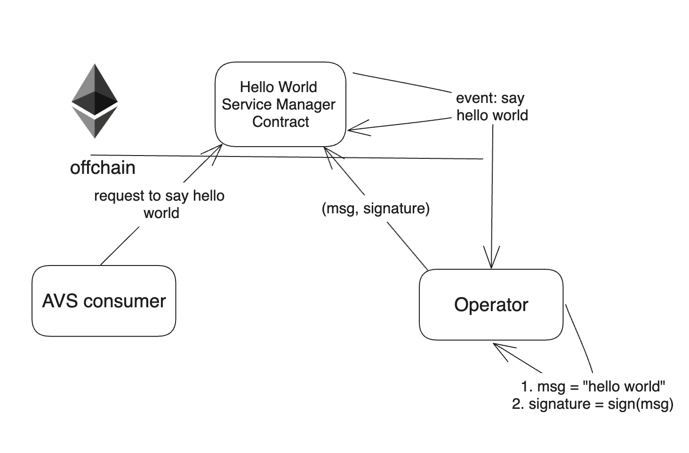

# Hello World AVS

Welcome to the Hello World AVS.

This project shows you the simplest functionality you can expect from an AVS.

It will give you a concrete understanding of the basic components.



There are 5 steps to this AVS:
- AVS consumer requests a "Hello World" message to be generated and signed
- AVS takes on the request by emitting an event for operators to pick up the request
- any operator who is staked to serve this AVS takes this request, generates this message and signs it
- the operator submits this message with their signature back to the AVS
- *if the operator is in fact registered to the AVS and has the minimum needed stake, the submission is accepted*

That's it. This simple flow highlights some of the core mechanics of how AVSs work.

Where additional sophistication with AVSs come into the picture:
- the nature of the request is more sophisticated than generating a constant string
- the operators might need to coordinate with each other
- the type of signature is different based on the constraints of the service
- the type and amount of security used to secure the AVS
- and so on...

## Quick Start

### Dependencies

1. [npm](https://docs.npmjs.com/downloading-and-installing-node-js-and-npm)
2. [Foundry](https://getfoundry.sh/)
3. [Docker](https://www.docker.com/get-started/)
   * Make sure the Docker daemon is running
4. (tcs)[https://www.npmjs.com/package/tcs#installation]
5. (ethers)[https://www.npmjs.com/package/ethers]


### Steps

#### Typescript

1. Run `yarn install`
2. Run `cp .env.local .env`
3. Run `make start-chain-with-contracts-deployed`
    * This will build the contracts, start an Anvil chain, deploy the contracts to it, and leaves the chain running in the current terminal
4. Open new terminal tab and run `make start-operator`
    * This will compile the AVS software and start monitering new tasks
5. Open new terminal tab and run `make spam-tasks` (Optional)
    * This will spam the AVS with random names every 15 seconds

#### Rust lang


##### Anvil 

1. Run `make start-chain-with-contracts-deployed`
    * This will build the contracts, start an Anvil chain, deploy the contracts to it, and leaves the chain running in the current terminal

2. Run `make start-rust-operator`

3. Run `make spam-rust-tasks`

Tests are supported in anvil only . Make sure to run the 1st command before running the  tests:

```
cargo test --workspace
```


##### Holesky Testnet

| Contract Name               | Holesky Address                                   |
| -------------               | -------------                                     |
| Hello World Service Manager | [0x3361953F4a9628672dCBcDb29e91735fb1985390](https://holesky.etherscan.io/address/0x3361953F4a9628672dCBcDb29e91735fb1985390)    |
| Delegation Manager          | [0xA44151489861Fe9e3055d95adC98FbD462B948e7](https://holesky.etherscan.io/address/0xA44151489861Fe9e3055d95adC98FbD462B948e7)                                           |
| Avs Directory               | [0x055733000064333CaDDbC92763c58BF0192fFeBf](https://holesky.etherscan.io/address/0x055733000064333CaDDbC92763c58BF0192fFeBf)      |

You don't need to run any script for holesky testnet.

1. Use the HOLESKY_ namespace env parameters in the code , instead of normal parameters.

2. Run `make start-rust-operator`

3. Run `make spam-rust-tasks `


## Extensions

- Operator needs a minimum stake amount to make submissions
- Add another strategy to the AVS
- Operator must respond within a certain number of blocks

## Deployment on Holesky

To deploy the Hello World AVS contracts to the Holesky network, follow these steps:

1. Ensure you have the necessary RPC URL and private key for the Holesky network.
2. Run the deployment script using Foundry:
    ```bash
    forge script script/HoleskyDeployer.s.sol:HoleskyDeployer --rpc-url $RPC_URL --private-key $PRIVATE_KEY --broadcast -vvvv
    ```
    Replace `$RPC_URL` with your Holesky RPC URL and `$PRIVATE_KEY` with your private key.

## Adding a New Strategy

To add a new strategy to the Hello World AVS, follow the guide provided in [`AddNewStrategy.md`](https://github.com/Layr-Labs/hello-world-avs/blob/master/AddNewStrategy.md). This guide walks you through the necessary steps to add and whitelist a new strategy for the AVS.


## Step by Step Deployment

The following instructions walk through deploying the EigenLayer contracts in detail (step by step). This is intended to be a template and learning exercise for users who wish to fork (modify) this repo and build their own AVS implementation.

### Dependencies

1. [npm](https://docs.npmjs.com/downloading-and-installing-node-js-and-npm)
2. [foundry](https://getfoundry.sh/)
3. [tcs - tiny static content server](https://www.npmjs.com/package/tcs#installation)
4. [ethers](https://www.npmjs.com/package/ethers)
5. [Docker](https://www.docker.com/get-started/)
   * Make sure the Docker daemon is running

### Steps to Deploy

#### In terminal window #1
```bash
# Install dependencies from package.json
yarn install

# Start a local Anvil chain instance.
anvil
```

#### In terminal window #2


```bash
# Setup local environment
cp .env.local .env
source .env
export PROJECT_ROOT_DIR=$(pwd)

# Build EigenLayer contracts
# Change of directory is required in order for the forge script to work properly
cd contracts/lib/eigenlayer-middleware/lib/eigenlayer-contracts
# Deploy EigenLayer Contracts. Note: the deployment process will require some time for compilation on the first run.
forge script script/deploy/devnet/M2_Deploy_From_Scratch.s.sol --rpc-url $RPC_URL --private-key $PRIVATE_KEY --broadcast --sig "run(string memory configFile)" -- M2_deploy_from_scratch.anvil.config.json --revert-strings debug

# Note the file M2_from_scratch_deployment_data.json contains the deployment data (addresses) of the deployed EigenLayer contracts

# Move back to the AVS contracts directory
cd $PROJECT_ROOT_DIR/contracts
# Deploy EigenLayer Middleware and AVS contracts. Note: the deployment process will require some time for compilation on the first run
forge script script/HelloWorldDeployer.s.sol:HelloWorldDeployer --rpc-url $RPC_URL --private-key $PRIVATE_KEY --broadcast --revert-strings debug

# Note the file hello_world_avs_deployment_output.json contains the deployment data (addresses) of the deployed AVS contracts


# Send 10 ETH to the operator address to enable them to register with the eigenlayer contracts in future steps
cast send 0x860B6912C2d0337ef05bbC89b0C2CB6CbAEAB4A5 --value 10ether --private-key 0x2a871d0798f97d79848a013d4936a73bf4cc922c825d33c1cf7073dff6d409c6

# Start the Operator service
# Move back to the AVS contracts directory
cd $PROJECT_ROOT_DIR
tsc && node dist/index.js
# Todo: fails at this step
```


(Optional) Run otterscan for an etherscan-style view of your local anvil chain:
```bash
docker run --rm -d -p 5100:80 --name otterscan -d otterscan/otterscan:latest
```
Open otterscan in your browser to begin browsing the transactions that deployed EigenLayer contracts ([example here](http://localhost:5100/block/1)).


#### In terminal window #3
Start the process to spam new tasks every 15 seconds

```bash
tsc && node dist/createNewTasks.js
```
